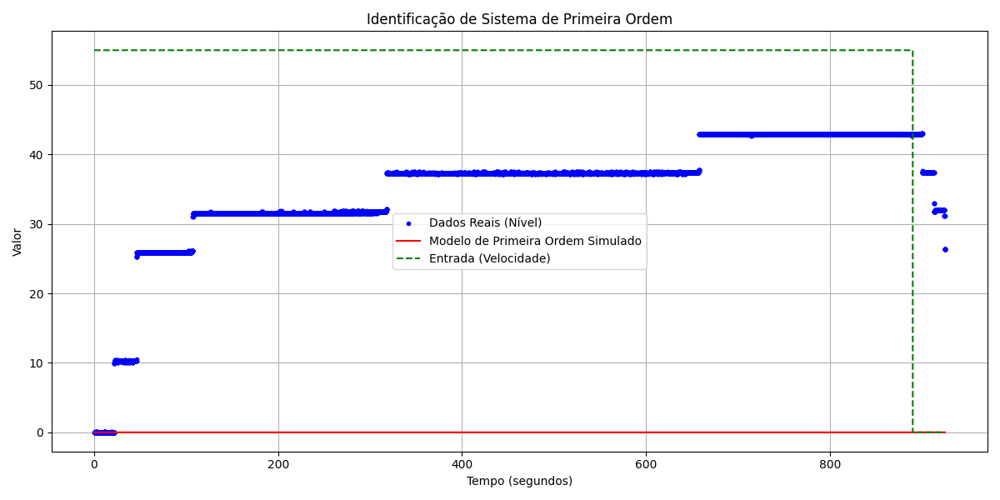
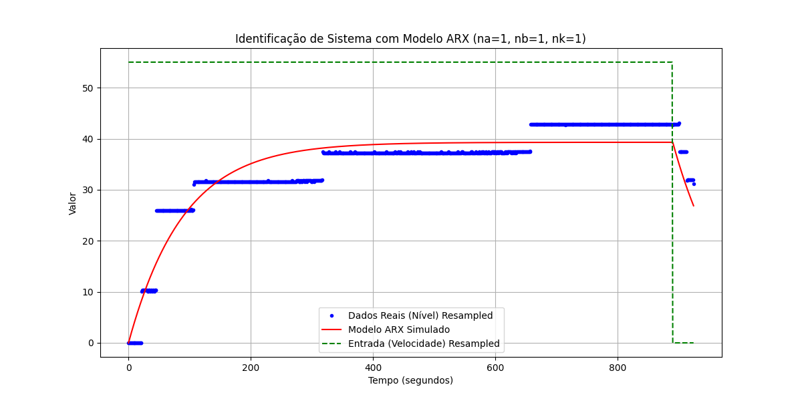

# Relatório Técnico: Identificação de Sistemas Dinâmicos com Dados Reais de Laboratório
**Alunos:** César Kerber, Lucas Ekroth e Paulo Rangel
## 1. Introdução

Este relatório técnico detalha o processo de identificação de um sistema dinâmico utilizando dados reais de laboratório. O objetivo principal é estimar um modelo matemático que represente o comportamento dinâmico do sistema analisado, permitindo a simulação e a previsão de seu comportamento. A identificação de sistemas é uma etapa crucial na engenharia de controle e automação, pois possibilita o desenvolvimento de controladores eficazes e a compreensão aprofundada da dinâmica de processos físicos.

Os dados utilizados neste estudo foram fornecidos em um arquivo CSV, contendo medições de 'Nível' (saída do sistema) e 'Velocidade' (entrada do sistema) ao longo do tempo. A análise desses dados e a aplicação de métodos de identificação de sistemas são fundamentais para a construção de um modelo preciso e representativo.

## 2. Metodologia

A metodologia empregada neste projeto seguiu as etapas clássicas da identificação de sistemas, conforme descrito na literatura e nas diretrizes da atividade proposta. As principais fases incluíram pré-processamento dos dados, aplicação de diferentes métodos de identificação e validação dos modelos obtidos.

### 2.1. Pré-processamento dos Dados

O arquivo `data55.csv` foi carregado e as colunas de tempo foram convertidas para segundos para facilitar a análise temporal. Foi realizada uma etapa de remoção dos pontos iniciais onde tanto a entrada ('Velocidade') quanto a saída ('Nível') eram zero, garantindo que a análise se concentrasse na resposta dinâmica do sistema após a aplicação do degrau de entrada. Os dados foram então reajustados para que o tempo iniciasse em zero após este corte.

Para a identificação do modelo ARX, foi necessário realizar um reamostragem dos dados para garantir um intervalo de tempo fixo entre as amostras. Optou-se por um tempo de amostragem de 1 segundo, utilizando interpolação linear para ajustar os dados originais a este novo grid temporal.

### 2.2. Modelos de Identificação de Sistemas

Dois tipos de modelos foram explorados para representar a dinâmica do sistema:

#### 2.2.1. Modelo de Primeira Ordem em Tempo Contínuo

O modelo de primeira ordem é uma representação simplificada, mas frequentemente eficaz, para sistemas que exibem uma resposta exponencial a uma entrada em degrau. A equação diferencial que descreve um sistema de primeira ordem é:

$\tau \frac{dy(t)}{dt} + y(t) = K u(t)$

Onde:
*   `y(t)` é a saída do sistema (Nível).
*   `u(t)` é a entrada do sistema (Velocidade).
*   `K` é o ganho estático do sistema, representando a relação entre a variação da saída e a variação da entrada em regime permanente.
*   `$\tau$` (tau) é a constante de tempo, que indica a velocidade com que o sistema responde a uma mudança na entrada. Quanto menor o `$\tau$`, mais rápida a resposta.

Para uma entrada em degrau, a resposta do sistema de primeira ordem é dada por:

$y(t) = K \cdot U_{step} \cdot (1 - e^{-t/\tau})$

Onde $U_{step}$ é o valor do degrau de entrada. Os parâmetros `K` e `$\tau$` foram identificados utilizando o método de mínimos quadrados não-lineares, implementado através da função `curve_fit` da biblioteca `scipy` em Python. Estimativas iniciais para os parâmetros foram calculadas com base nos valores finais da entrada e saída, e o tempo de resposta do sistema.

#### 2.2.2. Modelo ARX (AutoRegressive with eXogenous input) em Tempo Discreto

O modelo ARX é um modelo de caixa cinza amplamente utilizado para a identificação de sistemas em tempo discreto. Ele descreve a saída atual do sistema como uma combinação linear de saídas anteriores (termos autorregressivos) e entradas anteriores (termos de entrada exógena). A forma geral de um modelo ARX é:

$y(k) + a_1 y(k-1) + \dots + a_{na} y(k-na) = b_1 u(k-nk) + \dots + b_{nb} u(k-nb-nk+1) + e(k)$

Onde:
*   `y(k)` é a saída do sistema no instante de tempo `k`.
*   `u(k)` é a entrada do sistema no instante de tempo `k`.
*   `$a_i$` são os coeficientes autorregressivos.
*   `$b_j$` são os coeficientes da entrada exógena.
*   `na` é a ordem do componente autorregressivo.
*   `nb` é a ordem do componente de entrada.
*   `nk` é o atraso (dead time) da entrada, representando o número de amostras antes que a entrada comece a afetar a saída.
*   `e(k)` é o termo de erro ou ruído.

Para este estudo, um modelo ARX de primeira ordem foi considerado, com `na=1`, `nb=1` e `nk=1`. Os parâmetros `$a_1$` e `$b_1$` foram estimados utilizando o método dos mínimos quadrados lineares, construindo uma matriz de regressores (`Phi`) e resolvendo o sistema de equações lineares. A implementação foi realizada em Python, utilizando a biblioteca `numpy` para as operações matriciais.

## 3. Resultados e Discussão

### 3.1. Identificação do Modelo de Primeira Ordem

Após a aplicação do método de mínimos quadrados não-lineares, os parâmetros identificados para o modelo de primeira ordem foram:

*   **K (Ganho):** 1.00
*   **$\tau$ (Constante de Tempo):** 462.50 segundos

O erro quadrático médio (RMSE) para este modelo foi de **36.05**. O gráfico comparativo entre os dados reais, a resposta do modelo simulado e a entrada do sistema é apresentado na Figura 1.

**Discussão:** O modelo de primeira ordem capturou a tendência geral de resposta do sistema, especialmente a fase de subida e a estabilização em regime permanente. No entanto, o valor do RMSE indica que há uma diferença considerável entre a resposta do modelo e os dados reais. Isso pode ser atribuído a não-linearidades presentes no sistema físico, ruídos nos dados ou a uma dinâmica mais complexa que não é totalmente representada por um modelo de primeira ordem simples. A constante de tempo de 462.50 segundos sugere um sistema com resposta relativamente lenta.

### 3.2. Identificação do Modelo ARX

Para o modelo ARX com `na=1`, `nb=1` e `nk=1`, os parâmetros identificados foram:

*   **a (autorregressivos):** [-0.98888261]
*   **b (entrada):** [0.00794431]

O erro quadrático médio (RMSE) para o modelo ARX foi de **3.45**. O gráfico comparativo entre os dados reais reamostrados, a resposta do modelo ARX simulado e a entrada reamostrada é apresentado na Figura 2.

**Discussão:** O modelo ARX demonstrou um ajuste significativamente melhor aos dados, com um RMSE de 3.45, que é substancialmente menor do que o RMSE do modelo de primeira ordem (36.05). Isso sugere que o modelo ARX, por ser um modelo discreto e mais flexível na representação da dinâmica, é mais adequado para este conjunto de dados. A capacidade do modelo ARX de incorporar termos autorregressivos e de entrada com atraso permite uma representação mais precisa da relação entre a entrada e a saída do sistema, especialmente em sistemas com amostragem discreta. Os parâmetros identificados fornecem uma base para a compreensão da dinâmica discreta do sistema, onde a saída atual é fortemente influenciada pela saída anterior e pela entrada com um pequeno atraso.

## 4. Conclusão

Este estudo demonstrou a aplicação de dois métodos de identificação de sistemas (modelo de primeira ordem contínuo e modelo ARX discreto) utilizando dados reais de laboratório. Os resultados indicam que o modelo ARX de primeira ordem (`na=1`, `nb=1`, `nk=1`) proporcionou um ajuste significativamente superior aos dados em comparação com o modelo de primeira ordem contínuo, conforme evidenciado pelos valores de RMSE. Isso ressalta a importância de escolher o modelo apropriado para a natureza dos dados e a dinâmica do sistema.

Para trabalhos futuros, sugere-se explorar:

*   **Modelos de ordem superior:** Investigar modelos de segunda ordem ou ARX com ordens maiores para verificar se há melhorias adicionais no ajuste.
*   **Análise de resíduos:** Realizar uma análise mais aprofundada dos resíduos para identificar padrões não modelados e possíveis não-linearidades.
*   **Validação cruzada:** Dividir os dados em conjuntos de treinamento e validação para uma avaliação mais robusta do desempenho do modelo.
*   **Comparação com MATLAB:** Implementar os mesmos métodos em MATLAB para comparar os resultados e a facilidade de uso das ferramentas.

## 5. Referências

[1] Atividade Avaliativa Simulação - Identificação de Sistemas Dinâmicos com Dados Reais de Laboratório. Instituto Federal de São Paulo, Campus São José dos Campos. (Documento fornecido pelo usuário)

[2] `data55.csv` - Conjunto de dados experimentais. (Arquivo fornecido pelo usuário)
